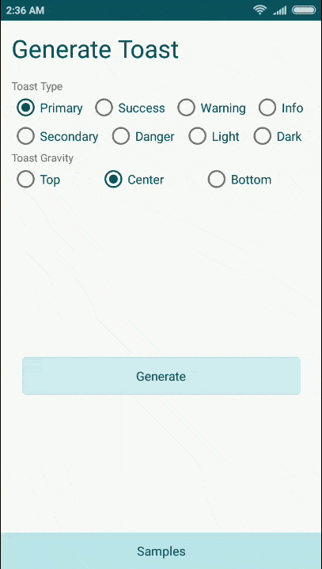
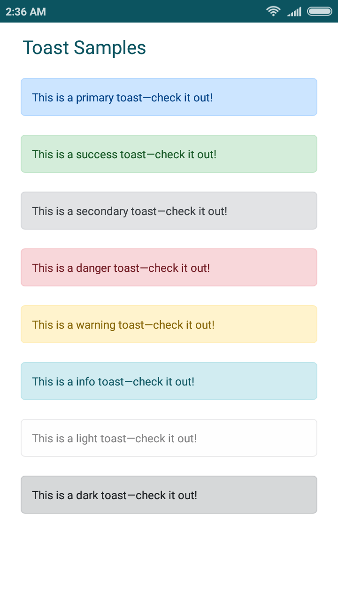

Cue
======
Library to create fully customizable Bootstrap styled alerts

[](https://android-arsenal.com/details/1/6722)
[](https://android-arsenal.com/api?level=9)
    
Demo
----



Usage
-----
Add in app build.gradle

```groovy
        allprojects {
            repositories {
                maven {
                    url "https://jitpack.io"
                }
            }
        }
```

Basic usage
```groovy
        Cue.init()
                .with(MainActivity.this)
                .setMessage("This is a sample Toast - Check it out")
                .setType(Type.PRIMARY)
                .show();
```

Types can be
```groovy
    PRIMARY, SUCCESS, SECONDARY, DANGER, WARNING, INFO, LIGHT, DARK, CUSTOM
```

Custom usage
```groovy
        Cue.init()
                .with(MainActivity.this)
                .setMessage("This is a sample Toast - Check it out")
                .setGravity(Gravity.CENTER_VERTICAL | Gravity.BOTTOM)
                .setType(Type.CUSTOM)
                .setDuration(Duration.LONG)
                .setBorderWidth(5)
                .setCornerRadius(10)
                .setCustomFontColor(Color.parseColor("#fd79a8"),
                        Color.parseColor("#ffffff"),
                        Color.parseColor("#e84393"))
                .setFontFace("fonts/custom_font.ttf")
                .setPadding(30)
                .setTextSize(20)
                .setTextGravity(Gravity.CENTER)
                .setHideToast(true)
                .show();
```


Download
--------

 [  ](https://bintray.com/fxn769/android_projects/Numpad/_latestVersion)  or grab via Gradle:
```groovy
        compile 'com.fxn769:cue:1.1'
```

or Maven:
```xml
        <dependency>
          <groupId>com.fxn769</groupId>
          <artifactId>cue</artifactId>
          <version>1.1</version>
          <type>pom</type>
        </dependency>
```

or ivy:
```xml
        <dependency org='com.fxn769' name='cue' rev='1.1'>
          <artifact name='cue' ext='pom' ></artifact>
        </dependency>
```

Snapshots of the development version are available in [Sonatype's `snapshots` repository][snap].

License
--------

    Copyright 2018 Akshay Sharma

    Licensed under the Apache License, Version 2.0 (the "License");
    you may not use this file except in compliance with the License.
    You may obtain a copy of the License at

       http://www.apache.org/licenses/LICENSE-2.0

    Unless required by applicable law or agreed to in writing, software
    distributed under the License is distributed on an "AS IS" BASIS,
    WITHOUT WARRANTIES OR CONDITIONS OF ANY KIND, either express or implied.
    See the License for the specific language governing permissions and
    limitations under the License.


 [snap]: https://oss.sonatype.org/content/repositories/snapshots/


                
